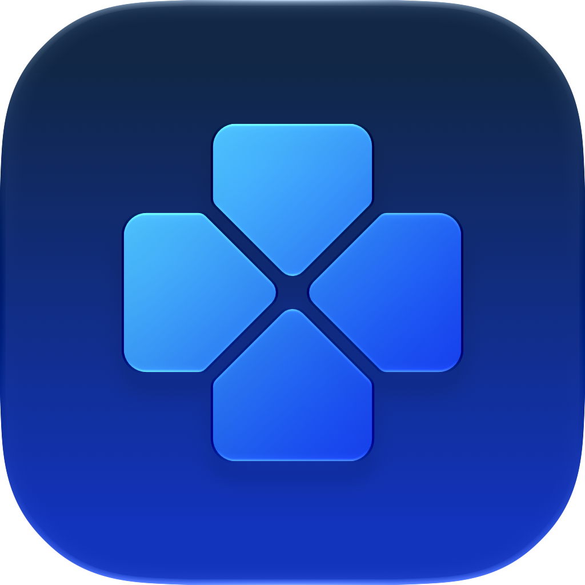

  

  # Launchogen

  **A basic Apple TV-like interface Launcher for Apps and Games.**

---

## 💻 System Requirements

* **Apple Silicon Device** (M1/M2/M3/M4 or later)
* *Intel Macs are **NOT** supported.*

## 📦 Installation

1. Download the latest release from the [Releases page](../../releases).
2. Extract the downloaded zip archive.
3. Drag and drop **Launchogen.app** into your `/Applications` folder.
